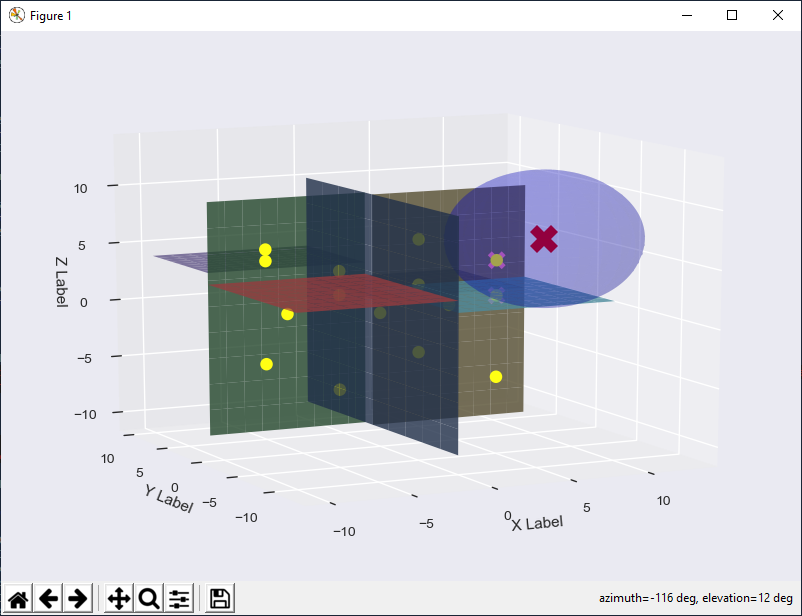

# knn with k-d trees
## Terms
k-nearest neighbors ([knn](https://en.wikipedia.org/wiki/K-nearest_neighbors_algorithm))  
k-dimensional tree ([k-d tree](https://en.wikipedia.org/wiki/K-d_tree))

## Description
The k-d tree data structure allows for efficient knn algorithms.  A simple implementation can be found in [kdtree.py](kdtree.py).  

# Visualizing k-d trees and knn

## 2D


## 3D



# KDTree usage

## Initialize
```python
num_dims = 2
points = [
    [0, 0],
    [4, 6],
    [5, 1],
    [6, -6],
    [-5, -5],
    [-4, -1],
    [-3, 5],
]
tree = KDTree(points, num_dims)
```

## Visualize
```python
tree.visualize(visual_type=VisualType.textual)
tree.visualize(visual_type=VisualType.graphical)
```

## knn
```python
point = [1, 4]
k = 3
result = tree.knn(point, k)
tree.visualize_knn(point, result)
```
